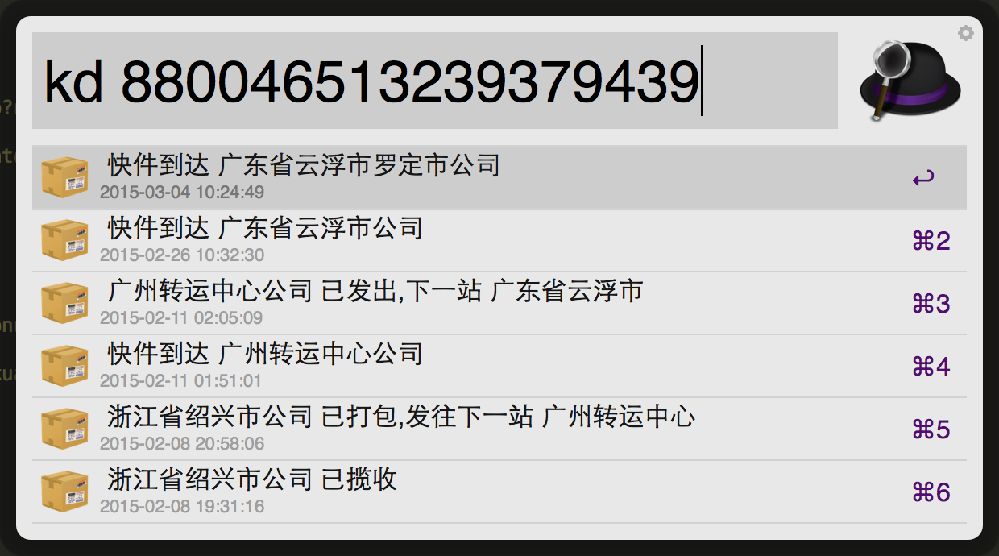

# ExpressAlfredWorkflow
在Alfred中查询快递信息，不需要选择快递公司，使用kuaidi100的查询接口

#说明
随便瞎搞了一个，因为找到了要么不能用，要么必须输入快递公司

图片什么的随便找的

效果图：

#下载地址

[click](https://raw.githubusercontent.com/justdark/ExpressAlfredWorkflow/master/express.alfredworkflow)